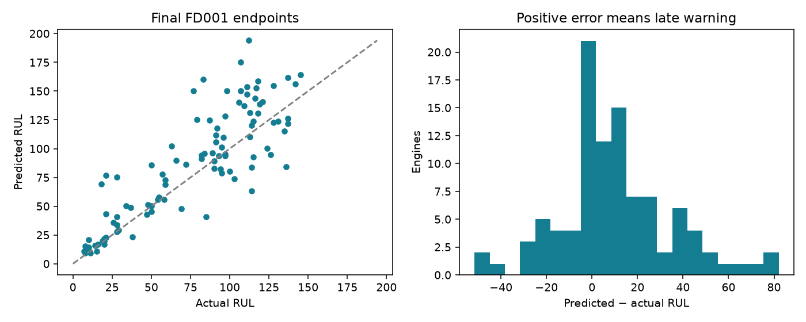
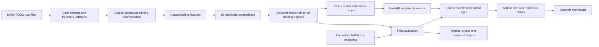
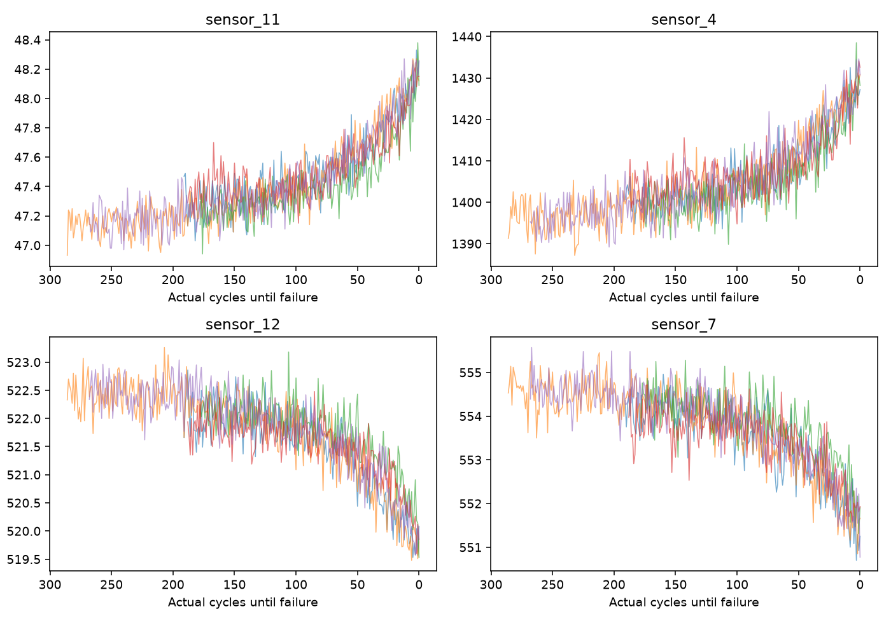
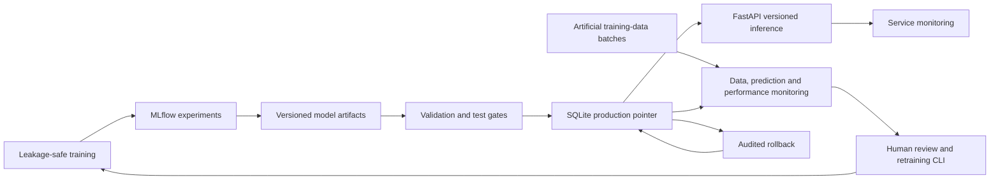

# Predictive Maintenance & Operational Analytics Platform

A reproducible decision-support system that estimates remaining useful life (RUL),
turns predictions into a maintenance review queue and demonstrates model tracking,
versioned serving, monitoring, retraining, controlled promotion and rollback. Built with
Python, scikit-learn, LightGBM, MLflow, SciPy, SQLite, FastAPI and Streamlit.

**Dataset:** NASA C-MAPSS FD001 contains **simulated turbofan-engine degradation**, not
customer or manufacturing-company telemetry. The project does not demonstrate downtime
reduction or financial savings.

## Verified results

The pipeline ran on 100 training engines (20,631 cycles) and 100 NASA test endpoints.
Extra Trees with a 15-cycle trailing window and uncapped labels won the predeclared
validation RMSE comparison. Model selection used 75 fitting engines and 25 held-out
engines, never NASA test labels.

| Final test measure | Result |
|---|---:|
| MAE | 19.50 cycles |
| RMSE | 27.01 cycles |
| NASA asymmetric score, summed over 100 endpoints | 9,986.28 |
| Near-failure recall at the 40-cycle action threshold | 15/16 (93.75%) |
| Missed near-failure engines | 1 |
| False action alerts, actual RUL >40 | 0/21 alerts |

These are uncapped endpoint metrics, not a claim of benchmark leadership. Engine 41
was missed: predicted 69.37 cycles versus 18 actual. Errors are larger above 80 actual
cycles (MAE 24.26) than at <=20 cycles (MAE 6.31). See the complete
[evaluation](reports/model_evaluation.md), [predictions](artifacts/predictions.csv),
[metrics](artifacts/metrics.json) and [comparison](artifacts/model_comparison.csv).



## Run locally

Python 3.12 is the verified runtime. Run commands from this repository root.
Using [uv](https://docs.astral.sh/uv/), the committed lock gives the exact resolved environment:

```powershell
uv sync --frozen --extra dev --python 3.12
uv run python run_pipeline.py --download
uv run python mlops.py bootstrap
uv run streamlit run app/dashboard.py
```

In another terminal:

```powershell
uv run uvicorn api.main:app --host 127.0.0.1 --port 8000
```

Tests and the optional full-artifact smoke check:

```powershell
uv run pytest -q
uv run ruff check .
uv run python -m scripts.verify_runtime
```

The existing workspace environment can also run commands directly, for example
`.\.venv\Scripts\python.exe run_pipeline.py`. A conventional alternative is
`python -m pip install -e ".[dev]"` inside a Python 3.12 virtual environment;
this resolves compatible ranges instead of the exact uv lock.

The smoke check verifies all three dashboard areas, API/batch parity on all 100 engines,
SQLite integrity and actual HTTP readiness of both launch commands, then stops its servers.
Local checks passed; the GitHub Actions workflow is configured but has not run on GitHub.

## Dataset access and provenance

Source: [NASA Prognostics Center of Excellence repository](https://www.nasa.gov/intelligent-systems-division/discovery-and-systems-health/pcoe/pcoe-data-set-repository/),
section 6, attributed to A. Saxena and K. Goebel (2008), *Turbofan Engine Degradation
Simulation Data Set*, NASA Ames. FD001 has one operating condition and one degradation mode.

`--download` retrieves the archive linked by NASA, extracts only the three FD001 files
including from nested ZIPs, and records SHA-256 hashes in `data/raw/provenance.json`.
Existing complete files are reused. Raw data and large generated binaries are git-ignored;
source attribution does not imply a new redistribution licence.

If downloading is unavailable, obtain the [NASA-linked archive](https://phm-datasets.s3.amazonaws.com/NASA/6.+Turbofan+Engine+Degradation+Simulation+Data+Set.zip),
open its C-MAPSS archive if nested, and put these files directly in `data/raw/`:

```text
data/raw/train_FD001.txt
data/raw/test_FD001.txt
data/raw/RUL_FD001.txt
```

Then run `uv run python run_pipeline.py`. Missing data produces a clear error; the
dashboard shows preparation instructions and the API returns HTTP 503 without a model.
The test suite creates synthetic trajectories and needs no download.

## Architecture and leakage controls



Training labels use `max(cycle) - cycle` within each engine. Test truth comes from the
separate endpoint RUL file. A fixed engine split prevents an engine appearing on both
sides. Five fractional-life endpoints per validation engine provide equal engine weight;
this proxy differs from the NASA test truncation distribution.

The fitting-engine-only channel filter retains 14 sensors and 2 settings. Cycle plus
current values, trailing means, population standard deviations and one-cycle deltas
produce 65 features. Windows are never centered, and engine histories never mix.
Scaling for Ridge is fitted only on fitting engines. No eventual lifetime enters features.
Tests assert that changing future values cannot change earlier features and that a recent
history window reproduces full-history inference.

Mean, Ridge, Extra Trees and LightGBM are compared at 5/15-cycle windows with uncapped
or 125-cycle capped training labels. All metrics use raw, uncapped truth. The winner is
frozen in `selection.json` before loading test data. No final-test tuning was performed.

## Analytical findings

Training lifetimes span 128–362 cycles, median 199. Sensor 11 has pooled correlation
−0.696 with RUL; sensors 4, 12 and 7 also show strong associations. Sensor 11 averages
47.401 in healthy observations (>80 RUL) and 48.024 in late life (<=20); sensor 12 moves
from 521.790 to 520.129. These descriptive associations are not causal evidence.

Setting 3 and sensors 1, 5, 6, 10, 16, 18 and 19 fail the low-information filter.
Cycle has the largest validation permutation importance (RMSE increase 9.08 cycles),
which also warns that lifetime-distribution changes could hurt generalisation.
See [business findings](reports/business_findings.md), [profile](reports/sensor_profile.csv),
[phase means](reports/phase_means.csv) and [feature importance](artifacts/feature_importance.csv).



## Operational interface

| Predicted cycles remaining | Status |
|---|---|
| <=20 | Critical |
| >20 to 40 | Schedule Maintenance |
| >40 to 80 | Monitor |
| >80 | Healthy |

These are project assumptions, not industry standards. The same function is used by batch
and API inference; the dashboard reads its persisted output. The final fleet contains 13
Critical, 8 Schedule Maintenance, 22 Monitor and 57 Healthy engines. Sensitivity results
are saved for action thresholds of 20–60 cycles. The retrospective validation first-alert
lead time is 35.28 cycles on average, but 6/25 first alerts occurred more than 40 cycles
before failure: this is exploratory warning behaviour, not measured intervention benefit.

- **Fleet Overview:** status counts, mean predicted RUL, priority queue and export.
- **Asset Detail:** observed sensor history, trailing trend, prediction and global drivers.
- **Model Performance:** candidate metrics, final-test errors, RUL bands and alert tradeoffs.

The SQLite database `artifacts/maintenance.sqlite` stores test cycle history, historical
`model_runs` and `model_predictions`. `current_predictions`, `maintenance_alerts` and
`fleet_status` views support operational queries. See [SQL examples](sql/operations.sql).

## API contract

`GET /health` reports readiness; `GET /model-info` describes the loaded version and history
requirement; `POST /predict` accepts one engine's consecutive recent observations.
All 26 raw fields are required. Provide at least `min(window, current_cycle)` rows.
For the selected model that is 15 recent cycles, or the entire shorter startup history.
Invalid keys, missing/non-finite data, duplicates, gaps or mixed engines return HTTP 422.
The interactive OpenAPI schema is at `http://127.0.0.1:8000/docs`.

Use the generated, complete [request](artifacts/example_request.json):

```powershell
Invoke-RestMethod -Method Post -Uri http://127.0.0.1:8000/predict -ContentType application/json -InFile artifacts/example_request.json
```

Recorded response excerpt (registry version changes only after activation):

```json
{"engine_id": 1, "cycle": 31, "predicted_rul": 194.04102513227508,
 "maintenance_status": "Healthy", "model_version": "1",
 "source_run_id": "ac65b75e9a7d44c29e59d777fd864fab"}
```

Normal serving resolves the active registry version on every request and reloads when the
version changes. `MAINTENANCE_ROOT` selects another project/artifact root. An explicit
`MAINTENANCE_MODEL` remains available for legacy/offline checks; it bypasses the registry
and should not be used for the production workflow. Original benchmark generation still
writes shared latest files: do not run concurrent original pipelines or run them while
benchmark dashboard pages are reading. MLOps promotion uses a transactional deployment pointer.

## MLOps lifecycle extension

The original benchmark above is unchanged. MLflow contains 19 finished runs and
three registered model versions after independent verification; SQLite holds the authoritative deployment pointer and audit
history. Version **1** remains production after a verified **1→2 promotion and 2→1 rollback**
against the same live API process. Versions 2 and 3 are previously approved challengers. Independent verification also exercised 1→3→1 without restarting FastAPI.



The challenger achieved validation RMSE **28.80 vs 29.23** and MAE **20.94 vs 21.16**,
with identical 100% near-failure recall and two false alerts on 125 validation endpoints.
Both recipes were refitted on the same 75 fitting engines for this comparison. No test
labels were used and no new final-test improvement is claimed.

Normal artificial replay triggered no drift/degradation flag (RMSE 6.23). Sensor bias
and operating-setting shifts triggered data drift and performance alerts (RMSE 31.38 and
12.84 respectively). None crossed the global predicted-RUL distribution threshold;
sensor bias changed the status distribution. Missing-schema input was rejected and reported.
**These are in-sample training-data replays, not new generalisation scores.**

Run MLflow separately (local SQLite tracking also works while the UI is stopped):

```powershell
uv run mlflow server --backend-store-uri sqlite:///artifacts/mlops/mlflow.sqlite --host 127.0.0.1 --port 5000 --workers 1
```

Create and monitor a batch, then train and qualify a challenger:

```powershell
$batch = (uv run python mlops.py simulate normal | ConvertFrom-Json).batch
uv run python mlops.py monitor $batch
# Other scenarios: sensor_bias, operating_shift, schema_failure
# To omit performance metrics when labels are unavailable: monitor $batch --unlabelled
$v = (uv run python mlops.py retrain | ConvertFrom-Json).version
uv run python mlops.py status
uv run python mlops.py qualify $v
uv run python mlops.py promote $v --reason "Passed validation gates and complete tests"
uv run python mlops.py rollback 1 --reason "Restore previous approved version"
```

The variable `$v` uses the version returned by retraining; existing versions 2 and 3 are historical approved challengers. Retraining never activates a model. `qualify` runs
the full test suite and binds evidence to source and artifact hashes; source changes require
qualification again. Promotion rejects failed gates, stale comparisons and stale test evidence.
Rollback accepts previously approved artifacts only. `bootstrap` is idempotent and will not
replace an existing production model. Future `run_pipeline.py` runs log/register their result
as candidates without switching production.

The new **MLOps / Monitoring** dashboard area shows the active version, monitoring history,
labelled errors, service volume/latency/errors and lifecycle events. The original three
areas intentionally retain their benchmark snapshot rather than masquerading as a live fleet.
`/model-info` now includes registry version, MLflow run, feature version and benchmark evidence
where available. Every prediction returns its resolved version; HTTP failures are logged too.

```powershell
uv run python -m scripts.verify_mlops
uv run python mlops.py qualify 3
uv run python -m scripts.verify_promotion 3
```

The promotion verification command requires a qualified candidate and restores the prior production version.
The original `scripts.verify_runtime` checks frozen benchmark parity and should run with
version 1 active. The original extension passed **48 tests**; the publication cleanup passes **55 tests**, four dashboard areas, MLflow HTTP readiness,
API telemetry checks and live promotion/rollback. Docker packaging and a CI build step exist,
and Docker build/start/health/model-info/predict parity were independently verified locally by the project owner. Local CI-equivalent sync, Ruff, pytest and Docker build passed; remote GitHub Actions remains unverified. See
[container commands and architecture](reports/production_architecture.md).

Read [verified extension results](reports/mlops_extension_summary.md),
[monitoring methodology](reports/model_monitoring.md),
[retraining and release gates](reports/retraining_and_promotion.md) and
[MLOps interview notes](reports/mlops_interview_notes.md).

## Repository guide

`src/maintenance/` holds validation, features, models, evaluation, reporting and database
modules; `api/`, `app/`, `tests/` and `sql/` contain their respective interfaces.
`artifacts/` contains results, the serialized model including preprocessing/feature recipe,
and per-run archives. `data/processed/` contains clean observations and model features.

Read [project summary](reports/project_summary.md), [technical decisions](reports/technical_decisions.md),
[limitations](reports/limitations_and_production_notes.md), [interview notes](reports/interview_notes.md),
[verified CV wording](reports/sample_cv_section.md) and [engineer handoff](HANDOFF.md).

This local prototype has no authentication, calibrated uncertainty or live ingestion.
Real deployment needs regime validation, censoring-aware labels, sensor contracts,
monitoring, release controls and engineering oversight. No cloud deployment is claimed.


## Publication cleanup and portability

Threshold sensitivity now varies only the prediction trigger and fixes false-alert truth at
actual RUL >40. The default 40-cycle policy and benchmark scores remain unchanged. Historical
archived sensitivity tables retain their original definition; use artifacts/threshold_sensitivity.csv
for the corrected comparison. Source edits invalidate historical qualification hashes for future
promotion, but Version 3 evidence is retained. See [publication audit](reports/publication_readiness.md).

To exercise every artificial scenario without retraining:

```powershell
foreach ($scenario in 'normal','sensor_bias','operating_shift','schema_failure') {
    $batch = (uv run python mlops.py simulate $scenario | ConvertFrom-Json).batch
    uv run python mlops.py monitor $batch
}
```

These commands append history; they are not required just to view the existing demo.
Historical MLflow artifact URIs contain the original absolute Windows location. Preserve those
records. A fresh clone creates a new local MLflow store rooted at its own location; copying an
old tracking database alone does not migrate artifact paths. Runtime deployment paths are
repository-relative. Export source and small reports using the ignore rules; retain a private
backup of the complete local artifacts/ directory to preserve audit history. No Git initialisation
or push is part of this cleanup.
