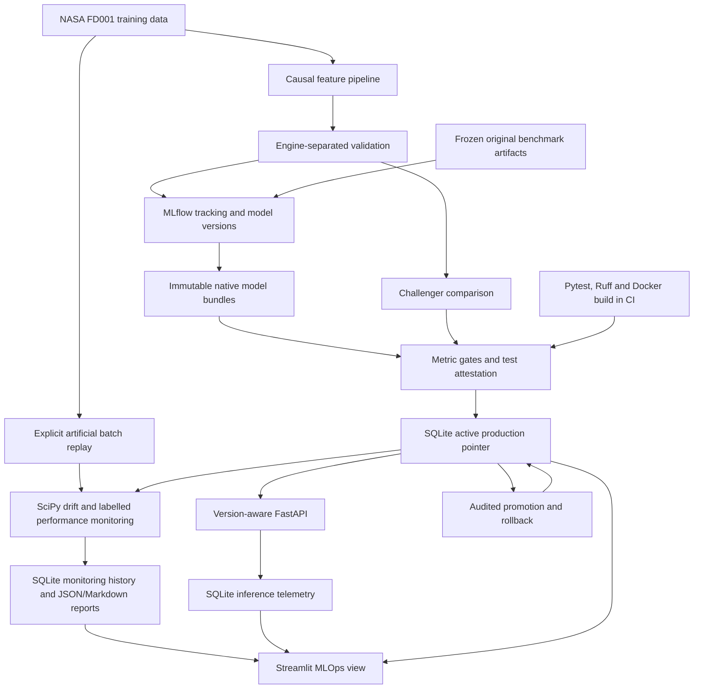

# Local production-style architecture



The original three dashboard areas keep their benchmark snapshot. The fourth displays
the active model and lifecycle evidence. The API does not need an MLflow server process:
it reads the transactional local registry and versioned files. Tracking uses a separate
MLflow SQLite database so MLflow manages its own schema. MLflow UI is optional.

| Storage | Purpose |
|---|---|
| artifacts/maintenance.sqlite | Original analytics plus production_model, model_versions, lifecycle_events, challenger_evaluations, test_attestations, monitoring_runs, inference_events |
| artifacts/mlops/mlflow.sqlite | MLflow experiments, runs and registered versions |
| artifacts/mlops/mlruns/ | MLflow logged artifacts |
| artifacts/mlops/models/ | Immutable copied native joblib bundles; relative paths portable into containers |
| artifacts/mlops/batches/ | Artificial observations, references, labels and manifests |
| artifacts/mlops/monitoring/ | Versioned monitoring outputs |
| artifacts/mlops/retraining/ | Candidate model and engine-separated evaluation evidence |

Only one pointer controls production. MLflow registry source paths refer to logged native
ModelBundle artifacts, not MLflow pyfunc serving models; the project loader owns feature
construction and validation. This avoids two implementations of inference logic. MLflow
versions are registered, but deployment status is intentionally managed by the SQLite layer.

## Docker

The Dockerfile packages the FastAPI app and locked dependencies on Python 3.12-slim,
installs libgomp for LightGBM, runs as a non-root user and declares an HTTP health check.
No raw dataset, credentials, local runtime or model binaries are baked into the image.
Mount the generated artifacts directory read/write: the service reads relative registered
model paths and writes inference events. On Linux the mount must be writable by UID 10001
(or run with an appropriate mapped UID). Use local-only host port binding.

```powershell
docker build -t maintenance-api:local .
docker run --rm -p 127.0.0.1:8000:8000 --mount "type=bind,source=$((Get-Location).Path)/artifacts,target=/app/artifacts" maintenance-api:local
```

The project owner independently verified this Docker build and container startup locally, including health/model-info, Version 1 loading, and prediction parity with native inference. Local CI-equivalent checks passed. Remote GitHub Actions remains unverified; no industrial/cloud deployment is claimed.

## Operational boundaries

SQLite serialises local writes; this is not a distributed registry. Registry activation is
transactional, but MLflow/file writes and original benchmark generation are not a single
cross-store transaction. Do not run concurrent original training pipelines. Telemetry is
best effort, not a durable queue. The local MLflow server needs no credentials and must remain
bound to localhost. Windows MLflow job execution is unsupported; orchestration uses the CLI.

Reference: [MLflow local database tracking](https://www.mlflow.org/docs/latest/ml/tracking/tutorials/local-database/).


Verify the running container from a second terminal:

```powershell
Invoke-RestMethod http://127.0.0.1:8000/health
Invoke-RestMethod http://127.0.0.1:8000/model-info
Invoke-RestMethod -Method Post -Uri http://127.0.0.1:8000/predict -ContentType application/json -InFile artifacts/example_request.json
```

Run the native API and container on different host ports if both are running. Historical MLflow
artifact URIs remain host-specific and are deliberately preserved; see publication_readiness.md.
